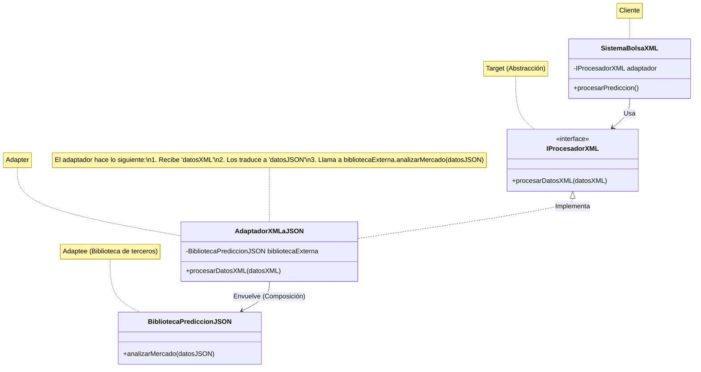

```mermaid
classDiagram
    class SistemaBolsaXML {
        -IProcesadorXML adaptador
        +procesarPrediccion()
    }
    note for SistemaBolsaXML "Cliente"

    class IProcesadorXML {
        <<interface>>
        +procesarDatosXML(datosXML)
    }
    note for IProcesadorXML "Target (Abstracción)"

    class AdaptadorXMLaJSON {
        -BibliotecaPrediccionJSON bibliotecaExterna
        +procesarDatosXML(datosXML)
    }
    note for AdaptadorXMLaJSON "Adapter"

    class BibliotecaPrediccionJSON {
        +analizarMercado(datosJSON)
    }
    note for BibliotecaPrediccionJSON "Adaptee (Biblioteca de terceros)"

    %% Relaciones
    SistemaBolsaXML --> IProcesadorXML : Usa
    IProcesadorXML <|.. AdaptadorXMLaJSON : Implementa
    AdaptadorXMLaJSON --> BibliotecaPrediccionJSON : Envuelve (Composición)

    %% Explicación del funcionamiento del adaptador
    note for AdaptadorXMLaJSON "El adaptador hace lo siguiente:\n1. Recibe 'datosXML'\n2. Los traduce a 'datosJSON'\n3. Llama a bibliotecaExterna.analizarMercado(datosJSON)"
```